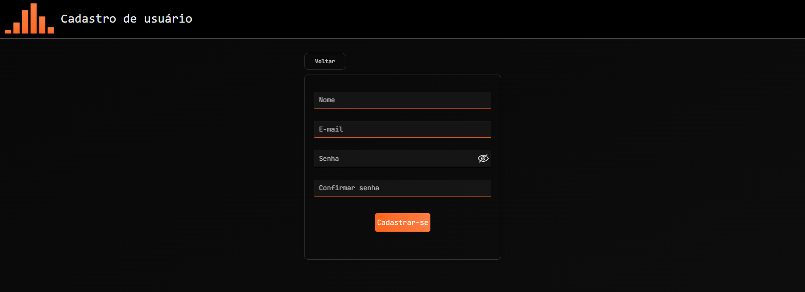
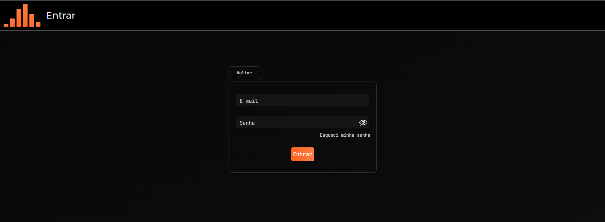
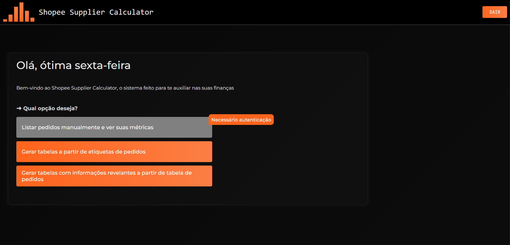
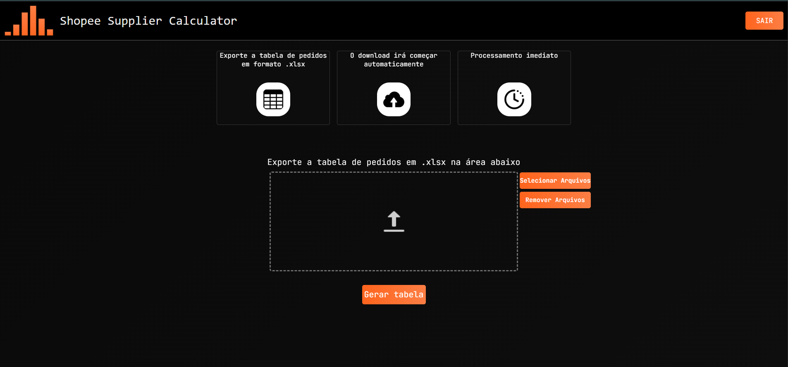

# ➜ API em Spring Boot/Java — Shopee Supplier Calculator
Shopee Supplier Calculator: https://shopee-supplier-calculator.netlify.app

O Shopee Supplier Calculator foi desenvolvido para auxiliar o gerenciamento financeiro de um grupo de comerciantes virtuais que possuem lojas centralizadas na plataforma da Shopee.

Ao comercializar produtos pela internet, é importante possuir uma forma eficiente de **registrar** os pedidos em **tabelas** ou **planilhas**. Entretanto, os comerciantes enfrentavam dificuldades nesse processo: o registro manual dos pedidos é repetitivo, trabalhoso e suscetível a erros, além da necessidade de calcular manualmente métricas como lucro e taxas de fornecedores.

Diante desse problema, surgiu a necessidade de **automatizar** e **simplificar** o gerenciamento dos pedidos, reduzindo o trabalho manual e a possibilidade de erros no preenchimento dos dados.

### ➜ Soluções propostas

Com base no problema identificado, foram propostas duas soluções:

- ***Solução 1***: facilitar o registro manual dos pedidos por meio de uma tabela simplificada, realizando automaticamente o cálculo de algumas métricas.

- ***Solução 2***: criar uma tabela totalmente automatizada, na qual o usuário precisa apenas fornecer um arquivo contendo as informações dos pedidos.

- Repositório solução 1: https://github.com/Nicolas-Geovane880/Shopee-Typescript-API-Backend
- Reposítorio solução 2: https://github.com/Nicolas-Geovane880/Shopee-SpringBoot-API-Backend

### ➜ O que tem nesse repositório?

Este repositório contém a aplicação frontend responsável por fornecer a interface de interação com as duas APIs do projeto.

A interface possui páginas para todas as funcionalidades das 2 APIs, englobando um design simples, minimalista porém agradável ao usuário.

Páginas principais:

- Login e Signup
- Home principal
- Lista manual (solução 1)
- Área de exportação de arquivos e geração de tabelas (solução 2)
- Validação de código de login
- Resetar senha

### ➜ Como a interface foi feita?

O projeto utiliza JSX para a construção da interface, CSS para estilização e JavaScript para a comunicação com as APIs por meio da Fetch API.

#### Por que o CRA?

O CRA (Create React App) é uma ferramenta utilizada para criar e configurar aplicações React. Atualmente, é uma tecnologia legada/depreciada e deixou de receber atualizações em fevereiro de 2025.

A escolha do CRA ocorreu principalmente devido à sua utilização nas disciplinas de desenvolvimento web da faculdade, nas quais adquiri experiência com essa estrutura.

Apesar de atualmente utilizar CRA, existe a intenção de migrar o frontend para uma solução mais atual à medida que novos conceitos e ferramentas do ecossistema React forem estudados.

### ➜ Imagens chaves da aplicação

<figure>
    <figcatpion>Imagem 1: Signup (cadastro)</figcaption>
    
</figure>

<figure>
    <figcatpion>Imagem 2: Login</figcaption>
    
</figure>

<figure>
    <figcatpion>Imagem 3: Home principal (repare que a primeira opção, referente a solução 1, está bloqueada. Isso acontece pois estou usando o recurso de "Usar recursos sem autenticação")</figcaption>
    
</figure>

<figure>
    <figcatpion>Imagem 4: Área de exportação de arquivos .xlsx</figcaption>
    
</figure>

### ➜ Libs utilizadas

- React Router Dom| roteamento de páginas
- AOS | criação de animações visuais

